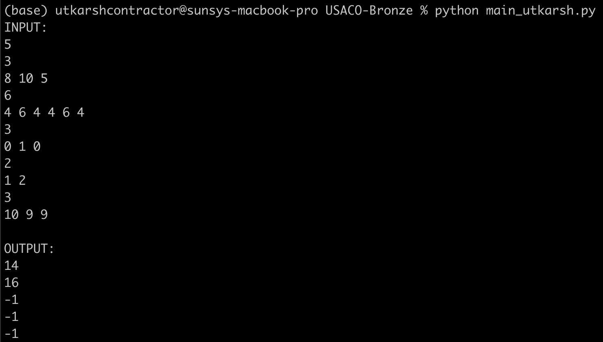

### Explanation of Code Logic
### Function feed_cow(): 
Calculates the minimum number of bags of corn needed to equalize the hunger levels of cows in a single test case. It iterates through the hunger levels twice, once for reducing hunger levels from the left and once after reversing the list (effectively reducing from the right). If it's impossible to equalize hunger levels, the function returns -1.

Function main: Handles multiple test cases. It reads the number of test cases and iterates over each case, calling feed_cows for each.

### Runtime Complexity Analysis
The function feed_cows contains a nested loop. The outer loop runs twice, and the inner loop runs n - 2 times per iteration of the outer loop, where n is the number of cows. Thus, the inner loop runs in O(n).
The reverse function is called twice, each time running in O(n).
The rest of the operations inside the loops are constant time operations.

```Therefore, the total time complexity of the feed_cows function is O(n) + O(n) = O(n), where n is the number of cows.```

```In the main function, feed_cows is called t times, where t is the number of test cases. Thus, the total time complexity of the program is O(t * n).```

### Sample Input (line delimited)
5
3
8 10 5
6
4 6 4 4 6 4
3
0 1 0
2
1 2
3
10 9 9

### Sample Output
14
16
-1
-1
-1

### Working Screenshot
